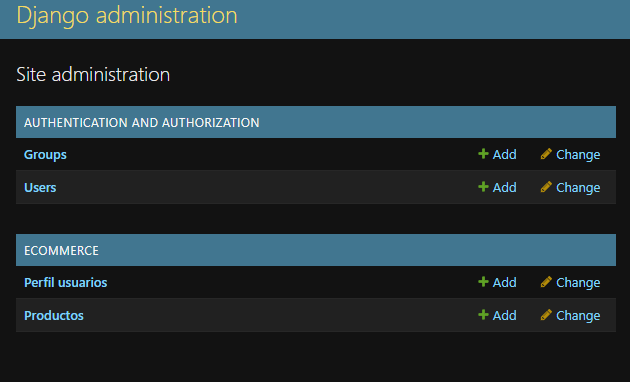
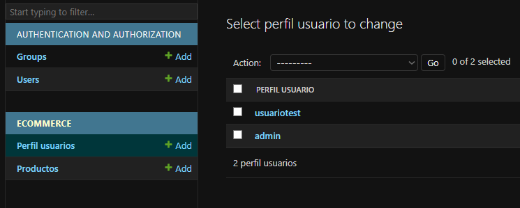
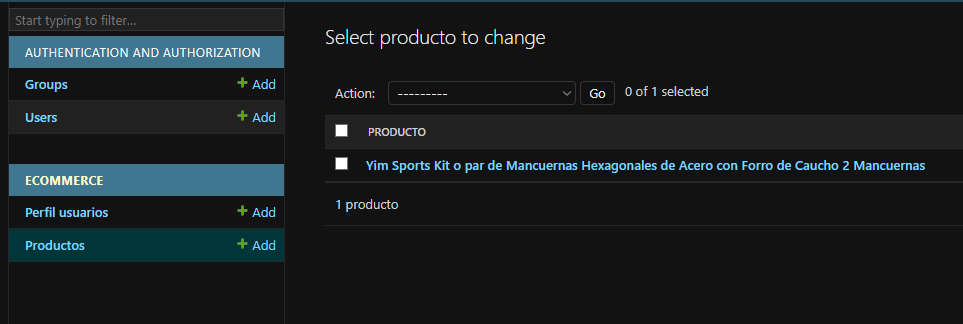
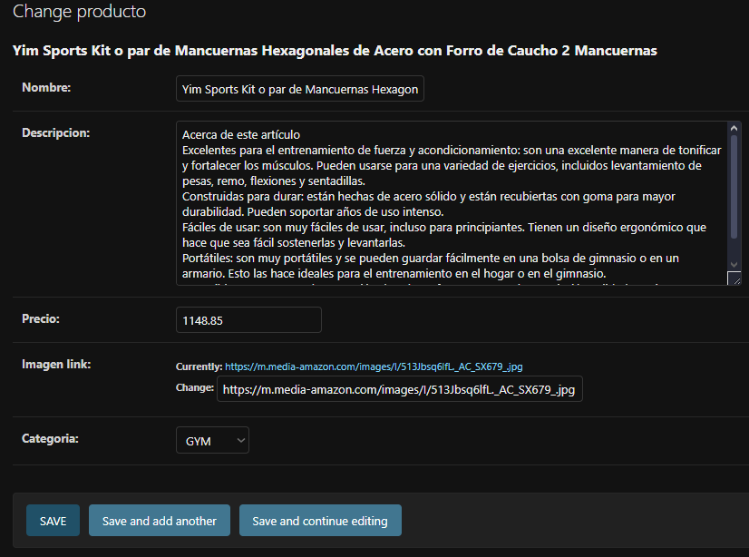

# Entrega del cuarto proyecto m65

## ¿Qué tal practicar?

**Objetivo**

Con lo aprendido hasta esta parte de Backend Python crea los modelos básicos para el e-commerce (usuarios y productos).

**Antes de comenzar**

Considera que este proyecto es la continuación del proyecto entregado en la parte de Frontend, por lo que será necesario que lo tengas a la mano pues en el siguiente módulo se utilizará

**Paso a paso:**

En este segundo avance de tu Proyecto final deberás crear los modelos básicos para el e-commerce, es decir, crearás los usuarios y productos. Sigue las instrucciones:

* Instalación de Django:
  Asegúrate de tener Django instalado en tu entorno de desarrollo. Puedes instalarlo utilizando pip, el gestor de paquetes de Python:


* Crear un nuevo proyecto Django:
  Crea un nuevo proyecto Django utilizando el siguiente comando en tu terminal:


* Crear una aplicación:
  Navega hasta el directorio de tu proyecto y crea una nueva aplicación Django que contendrá tus modelos:


* Definir modelos:
  Abre el archivo [models.py](http://models.py/) dentro de la carpeta de tu aplicación ecommerce. Define los modelos para usuarios y productos utilizando la sintaxis de Django ORM.
* Realizar migraciones:
  Ejecuta el siguiente comando para crear las migraciones para tus modelos:


* Crear usuarios y productos:
  Ahora puedes crear usuarios y productos a través del shell de Django o mediante la interfaz de administración de Django.
* Interfaz de administración (opcional):
  Si deseas administrar tus usuarios y productos a través de una interfaz web, puedes registrar tus modelos en el archivo [admin.py](http://admin.py/) dentro de tu aplicación ecommerce y crear un superusuario para acceder a ella:


Y luego ejecutas:


Sigue las instrucciones para crear un superusuario y luego inicia el servidor:


Accede a la interfaz de administración en [http://localhost:8000/admin](http://localhost:8000/admin) e inicia sesión con las credenciales del superusuario.

Estas instrucciones te ayudarán a configurar modelos básicos para usuarios y productos en tu proyecto de e-commerce con Django. Puedes expandir estos modelos y agregar más funcionalidades según tus necesidades específicas.

* Añade el código de tu proyecto del repositorio Github con el nombre “Modelos Básicos del e-commerce - Usuarios y productos”.
* En un archivo Pdf pon el link a tu repositorio y copia y pega el código que creaste y súbelo a la plataforma.

**¿Cómo presentar su entrega?**

Enlace a GitHub

**Tiempo estimado de resolución: **180 minutos

---

## Comenzando

### Ambiente virtual

Para este tipo de proyectos, acostumbro a utilizar ambientes virtuales en un intento de encapsular las apps, tal como hace docker, así que comenzamos por crear el ambiente virtual:

> Nota
>
> En algunos casos Powershell bloquea la ejecución de scripts, así que podemos usar el siguiente comando para permitirlos durante la sesión:
>
> powershell -ExecutionPolicy Bypass

```
python -m venv .venv
.venv\Scripts\Activate
pip install django

```

- Archivo de requerimientos

Aprovechamos para crear el archivo de requerimientos y tener aún más control sobre las versiones y compatibilidad, logrando el encapsulamiento de la app como queremos.

Desde la misma carpeta que contiene el .venv

```
pip freeze
```

Nos dará una lista con las dependencias, que nos limitamos a copiar y pegar en un archivo "requeriments.txt"

> Nota
>
> Para crear un archivo desde la consola de VS code, usamos el comando
>
> type nul > requirements.txt
>
> Para instalar las dependencias, con el ambiente virtual activo, usamos el comando:
>
> pip install -r requirements.txt

### Creando proyecto ministore

Una vez que tenemos el ambiente virtual con Django instalado, ejecutamos el siguiente comando para iniciar un proyecto de django

```
django-admin startproject ministore 
```

Accedemos al proyecto y creamos una app llamada ecommerce

```
cd .\ministore\
python manage.py startapp ecommerce
```

Aprovechando que estamos aquí, corremos el siguiente comando para que se genere la base de datos vacía (sqlite)

```
python manage.py migrate
```

## Codeando

### Crear modelos en app ecommerce

Tal como marca la actividad, crearemos los modelos básicos de productos y usuarios

- \05-fourth-project\ministore\ecommerce\models.py

```python
from django.db import models
from django.contrib.auth.models import User

CATEGORY_CHOICES = [
    ("GM", "GYM"),
    ("LB", "LIBROS"),
]

class Producto(models.Model):
    nombre = models.CharField(max_length=200)
    descripcion = models.TextField()
    precio = models.DecimalField(max_digits=10, decimal_places=2)
    imagen_link = models.URLField(null=True)
    categoria = models.CharField(max_length=2,choices=CATEGORY_CHOICES)

    def __str__(self):
        return self.nombre
  
class PerfilUsuario(models.Model):
    usuario = models.OneToOneField(User, on_delete=models.CASCADE, null=True)

    def __str__(self):
        return self.usuario.username

```

Tomé como referencia el frontend que anteriormente generamos:

[Mini store](https://yisusdu.github.io/ebac-ea-third-proyect/home)

### Registro en el admin

Para poder administrar los usuarios desde el admin de Django, los registramos en el admin

- \05-fourth-project\ministore\ecommerce\admin.py

```python
from django.contrib import admin
from .models import PerfilUsuario, Producto

admin.site.register(PerfilUsuario)
admin.site.register(Producto)
```

### Registro en Django instaled apps

Para que Django nos genere las migraciones de nuestra nueva app, es necesario registrarla en el archivo de settings

- 53-web-scraping\05-fourth-project\ministore\ministore\settings.py

```python
INSTALLED_APPS = [
    "django.contrib.admin",
    "django.contrib.auth",
    "django.contrib.contenttypes",
    "django.contrib.sessions",
    "django.contrib.messages",
    "django.contrib.staticfiles",
    "ecommerce"
]
```

### Correr migraciones

Con los modelos creados, corremos migraciones para aplicar

- 05-fourth-project\ministore

```
python manage.py makemigrations
python manage.py migrate
```

### Creando superuser

Aprovechando que estamos en la consola, creamos un superusuario:

- 05-fourth-project\ministore

```
python manage.py createsuperuser
```

## Probando Django admin

Corremos el servidor para verificar la correcta visualización de los modelos

- 05-fourth-project\ministore

```
python manage.py runserver
```

Ahora nos dirigimos al siguiente enlace y podemos ver la vista de django(login previos necesario)

- http://127.0.0.1:8000/admin/



He creado 2 usuarios, el admin con permisos de admin(desde la consola) y otro "común"



Tambien cree algunos productos, planeo hacer un scraping, generar un JSON y con el cargar la DB 




